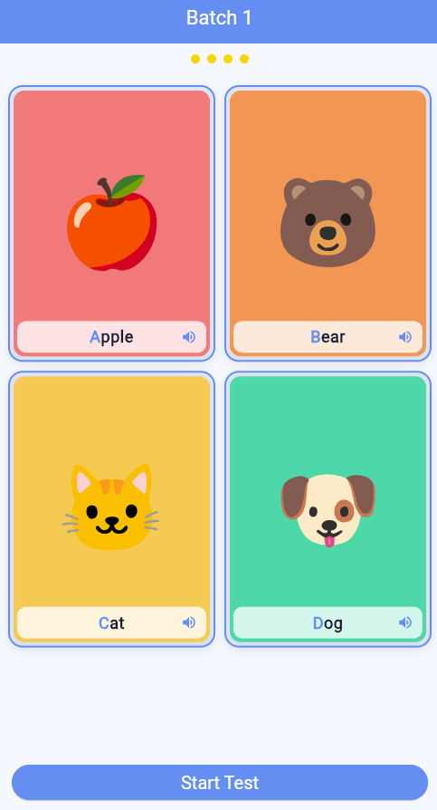
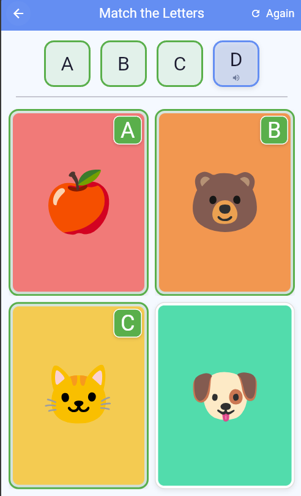

A small alphabet-learning game aimed at young children, built to make first encounters with letters playful rather than a chore.

- Six alphabets and languages bundled in: English, Russian, Ukrainian, Polish, Spanish, and German.
- Built with Flutter and runs as a self-contained web app, embedded directly into the site.

## How it works

The game has two modes: one for learning the letters, and one for testing what stuck.

**Learning.** Children go through the alphabet in small batches, such as A to D. Each card shows a picture with its word, the first letter highlighted, and a speaker button that reads the word aloud.

**Testing.** When a batch is done, "Start Test" turns it into a matching game: the child matches each letter at the top to the right picture. Matched cards get a green frame and their letter, and "Again" starts the round over.

## Gameplay demo

<iframe
    src="https://www.youtube-nocookie.com/embed/fSYAs8WwUMw"
    title="ABC Game gameplay, Spanish-language example"
    loading="lazy"
    allow="accelerometer; clipboard-write; encrypted-media; gyroscope; picture-in-picture; web-share"
    referrerpolicy="strict-origin-when-cross-origin"
    allowfullscreen
></iframe>

A Spanish-language example. [Watch on YouTube](https://youtu.be/fSYAs8WwUMw)
