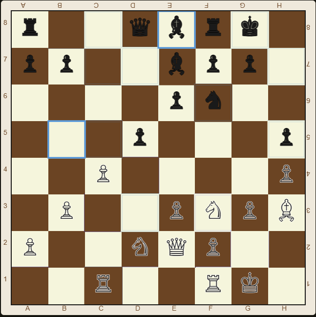

This project comes in two flavors: a native desktop app written in C++ with Qt, and a JavaScript version you can play instantly, right here on the site.

## Play it in your browser

A full chess board rendered on canvas, playable against [Stockfish](https://stockfishchess.org/) compiled to WebAssembly and running entirely in your browser — no server round-trips for moves.

- Adjustable engine difficulty, from 0 to 20.
- Full move history and captured-piece tracking alongside the board.
- Pawn promotion, undo, and surrender flows, all handled client-side.

Here's a game against the robot in full swing. The History panel keeps score move by move, and the trays above and below the board collect every fallen piece, so you can tell at a glance who's winning the material battle. Down below sit the controls: pick a difficulty from 0 to 20, and if things go badly, there's always Undo. Or, for the truly desperate, Surrender. The robot is a gracious winner.

### Two players, one screen

No robot needed: untick "Play against the robot" and the same board becomes a pass-and-play game for two people sharing one device. Look closely at the edges: the letters along the top and the numbers on the right are printed upside down. They're for the player sitting across the table. Lay a tablet flat between you, and it's just like a real board, minus hunting for that missing pawn under the sofa.

## The original C++/Qt version

The project started life as a native Qt chess UI written in C++, before being ported to the browser. [See the C++ code on GitHub](https://github.com/novaua/qt-chess).

<iframe
    src="https://www.youtube-nocookie.com/embed/hlW6xv23fN4"
    title="Chess C++/Qt desktop app gameplay demo"
    loading="lazy"
    allow="accelerometer; clipboard-write; encrypted-media; gyroscope; picture-in-picture; web-share"
    referrerpolicy="strict-origin-when-cross-origin"
    allowfullscreen
></iframe>

Gameplay demo of the desktop app. [Watch on YouTube](https://www.youtube.com/watch?v=hlW6xv23fN4)

## Where it all started

For comparison, here's an early video of one of the first working versions of the desktop app:

<iframe
    src="https://www.youtube-nocookie.com/embed/pBiuGpj8seQ"
    title="Chess++ program gameplay, an early version of the desktop app"
    loading="lazy"
    allow="accelerometer; clipboard-write; encrypted-media; gyroscope; picture-in-picture; web-share"
    referrerpolicy="strict-origin-when-cross-origin"
    allowfullscreen
></iframe>

"Chess++ program gameplay", the early version. [Watch on YouTube](https://www.youtube.com/watch?v=pBiuGpj8seQ)
