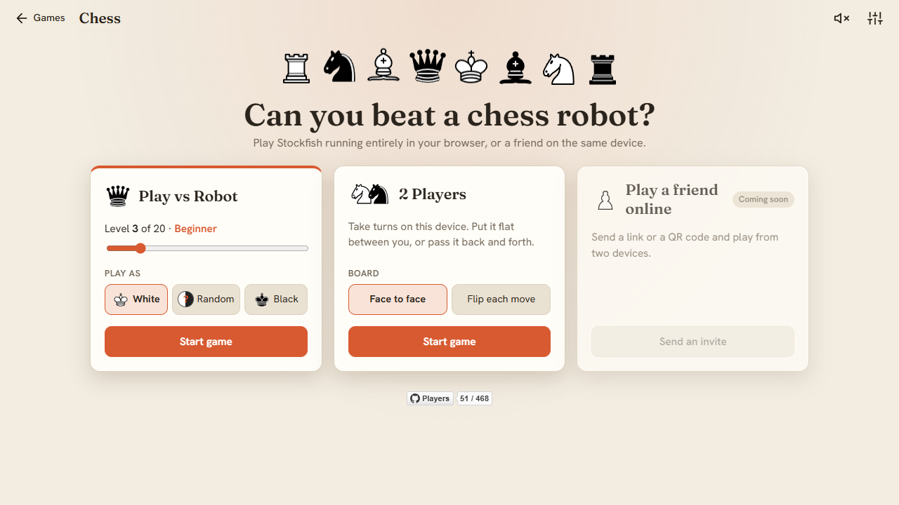
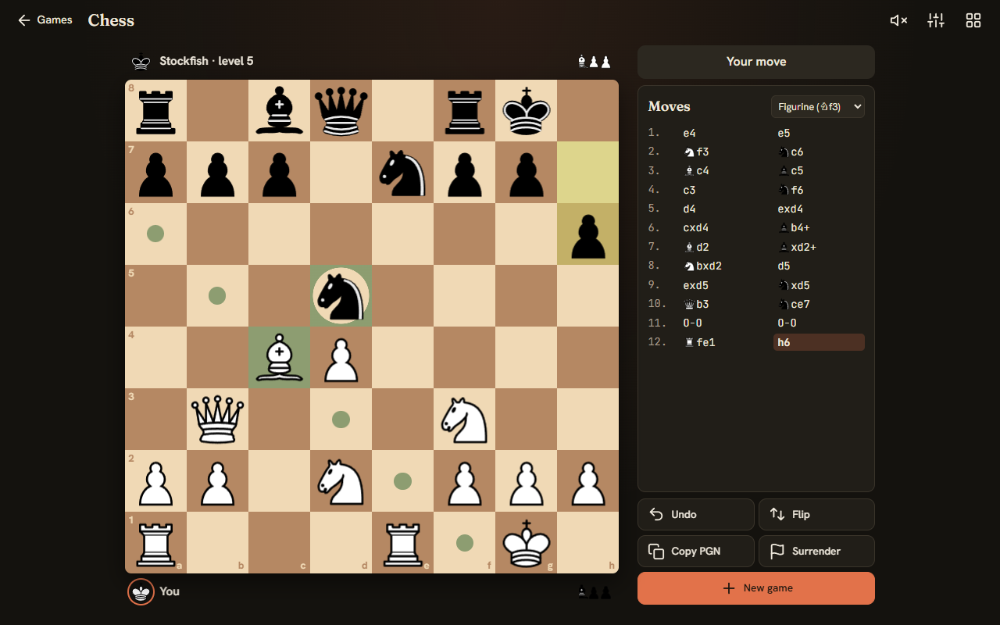
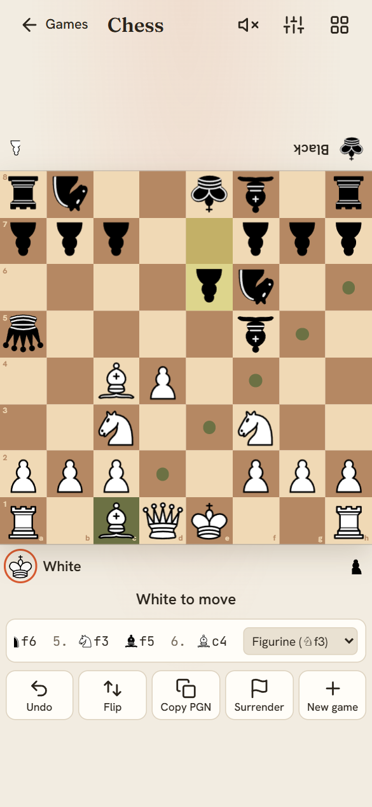
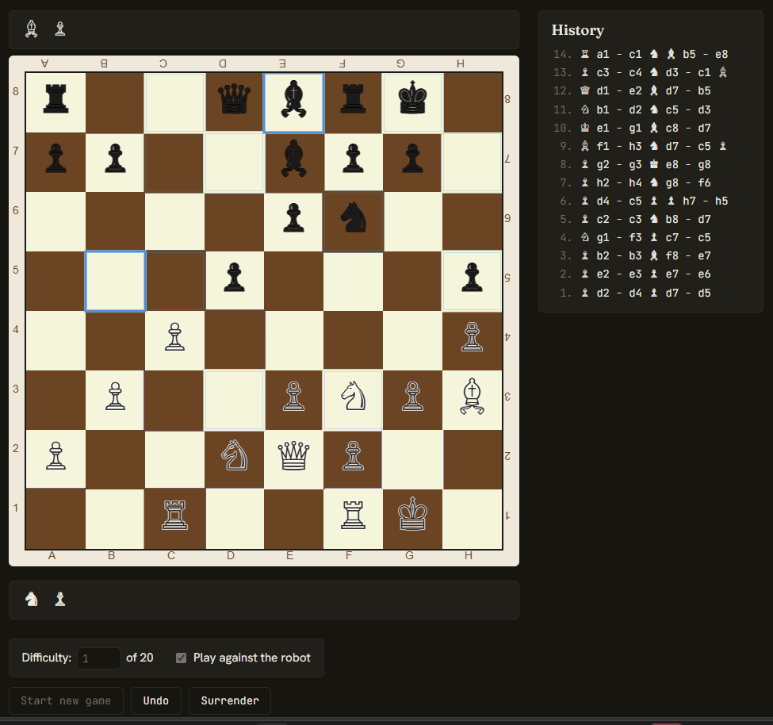

This project comes in two flavors: a native desktop app written in C++ with Qt, and a JavaScript version you can play instantly, right here on the site.

## Play it in your browser

A chess board built from plain HTML, CSS and SVG, playable against [Stockfish](https://stockfishchess.org/) compiled to WebAssembly and running entirely in your browser. There are no server round-trips for moves.

- A main menu: play the robot at a level from 0 to 20 as White, Black or a random color, or play a friend on the same device. Online play with a link or QR code is coming.
- Drag the pieces or tap to move. They slide across the board instead of teleporting, and legal moves show up as dots.
- Move history in official algebraic notation (with little piece icons, or plain letters), or in the old from–to style.
- Copy the game as PGN to analyze it anywhere, plus undo, surrender, flip the board, board colors, two piece sets and optional sound effects.
- Built for phones too: the board fills the screen in portrait, and the controls move beside it in landscape.

Here's a game against the robot in dark mode. The white bishop is picked up, and the dots show where it can go; the ring around the black knight on d5 means it can be captured. Each side's captured pieces sit next to the player names, and the move list on the right keeps score in figurine notation. If things go badly, there's always Undo. Or, for the truly desperate, Surrender. The robot is a gracious winner.

### Two players, one screen

No robot needed: pick "2 Players" and the same board becomes a pass-and-play game for two people sharing one device. In "Face to face" mode Black's pieces and name are drawn upside down for the player sitting across the table. Lay a phone or tablet flat between you, and it's just like a real board, minus hunting for that missing pawn under the sofa. Prefer to pass the device back and forth? "Flip each move" turns the board for whoever's turn it is.

### The first browser version

The first web version drew everything on a canvas, with Unicode chess symbols for pieces and a difficulty number box under the board. It worked, but it was click-only and a bit cramped on phones, which is what the 2.0 redesign set out to fix.

## The original C++/Qt version

The project started life as a native Qt chess UI written in C++, before being ported to the browser. [See the C++ code on GitHub](https://github.com/novaua/qt-chess).

<iframe
    src="https://www.youtube-nocookie.com/embed/hlW6xv23fN4"
    title="Chess C++/Qt desktop app gameplay demo"
    loading="lazy"
    allow="accelerometer; clipboard-write; encrypted-media; gyroscope; picture-in-picture; web-share"
    referrerpolicy="strict-origin-when-cross-origin"
    allowfullscreen
></iframe>

Gameplay demo of the desktop app. [Watch on YouTube](https://www.youtube.com/watch?v=hlW6xv23fN4)

## Where it all started

For comparison, here's an early video of one of the first working versions of the desktop app:

<iframe
    src="https://www.youtube-nocookie.com/embed/pBiuGpj8seQ"
    title="Chess++ program gameplay, an early version of the desktop app"
    loading="lazy"
    allow="accelerometer; clipboard-write; encrypted-media; gyroscope; picture-in-picture; web-share"
    referrerpolicy="strict-origin-when-cross-origin"
    allowfullscreen
></iframe>

"Chess++ program gameplay", the early version. [Watch on YouTube](https://www.youtube.com/watch?v=pBiuGpj8seQ)
